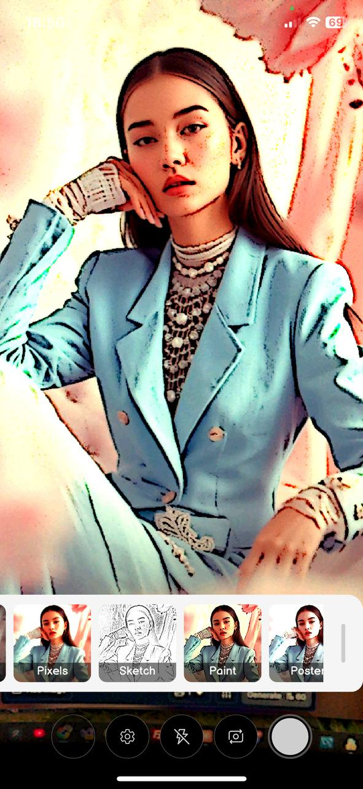

# Filters Camera

Open-source app for iOS, Mac Catalyst, Android and Windows applying hardware-accelerated shaders in real-time to camera preview and saved photos. 
Comes with built-in desktop [SKSL](https://skia.org/docs/user/sksl) editor.

SKSL shaders demonstrate: film grain, cubic splines, various image adjustments, lens distortion effects, edge detection and much more.

Please star ⭐ if you like it!

Support: [ask your question here](https://github.com/taublast/ShadersCamera/discussions)

* Applying shaders to camera preview in real-time
* Switch mirror preview
* Switch full-screen/fit preview
* Saving captured photo with shader effect
* Saving EXIF and injecting custom metadata
* Select camera and photo quality/format
* Edit shaders code in standalone window when running on desktop

Read [the blog article](https://taublast.github.io/posts/FiltersCamera/) 👈

### Install

* [AppStore](https://apps.apple.com/us/app/filters-camera/id6749823005?platform=iphone)

* [Google Play](https://play.google.com/store/apps/details?id=com.appomobi.drawnui.shaderscam)

* Run on Windows and MacCatalyst compiling from source code

### How To Use

- Tap anywhere on the screen to set current frame as preview
- Choose your real-time filter from previews in drawer menu!
- Open settings for more!

For Windows/Android users best with Photo Link app to instantly view your taken mobile photos!

### Interaction:

- On-screen buttons:  View Captured, Settings, Flash, Source, Capture Photo
- User drawer menu to select filters
- Tap anywhere on the screen to use current frame for drawer previews
- Zoom with fingers
- On desktop long pressing shader preview opens SKSL editor

### On The Roadmap

* Rotate saved photo on iOS if taken while rotated even if rotation turned off for app
* Rotate previews in menu when phone is rotated to landscape
* Save filter name to EXIF (what field, Software (0x0131)?)
* Add selection indicator for previews, scroll to selected at startup
* Pass rendering scale as uniform for all shaders for full consistency between preview and large capture
* Localization and change language in settings

### Optional To-Do

* Create presets (BW, For Kids etc..)
* Crop manual/presets
* Combine with lens shaders
* Save geolocation to EXIF
* Shaders editor for mobile version
* ML Z-axis detection and apply smart bokeh

### .NET MAUI Libs Stack

* [SkiaSharp](https://github.com/mono/SkiaSharp)
* [DrawnUi for .NET MAUI](https://github.com/taublast/DrawnUi)
* [FastPopups for .NET MAUI](https://github.com/taublast/FastPopups)

### Contributing

Contributing to repository is very welcome. Many other nifty shaders could be added, the current UI is also not something fixed.

### Credits

* **App Screenshots** - created with [Hotpot](https://hotpot.ai/)

### Related

* Playing with shaders: [ShadersCarousel](https://github.com/taublast/ShadersCarousel)

* Another `SkiaCamera` usage example: [DrawnUI Demo](https://github.com/taublast/DrawnUi.Maui.Demo)

---

Made with [DrawnUI for .NET MAUI](https://drawnui.net)

---

